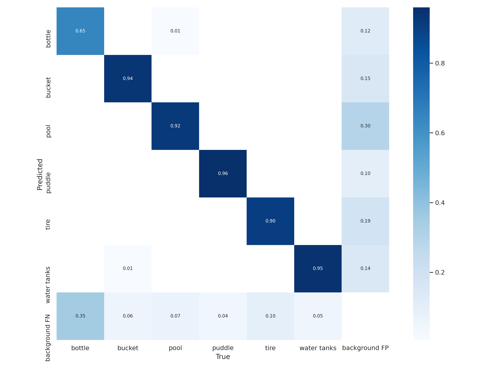
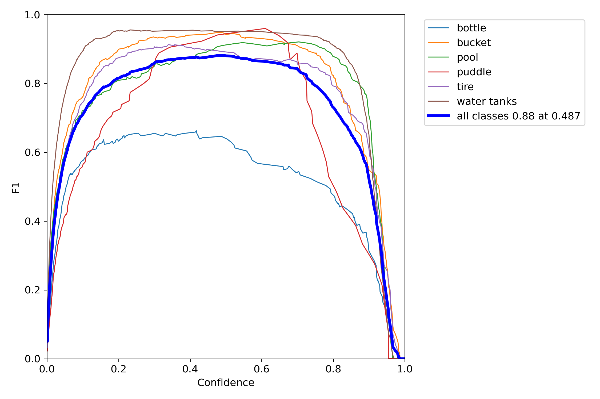
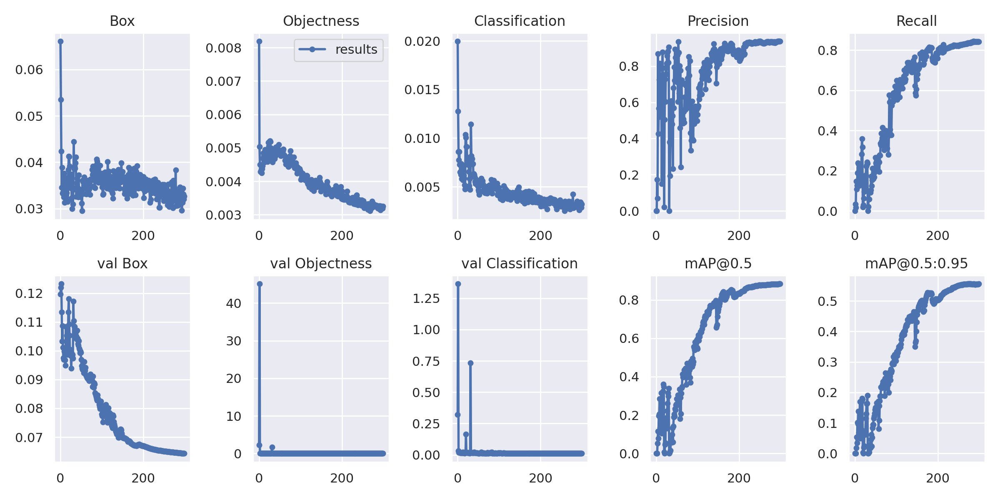

# Automatic Detection of Mosquito Breeding Grounds

This project aims to detect mosquito breeding grounds using YOLOv7 with a Transformer Prediction Head (Swin Transformer) using pre-trained weights based on VISDRONE dataset. The dataset used consists of a subset of videos 2, 6, 9, and 12 from the [Mosquito Database](https://www02.smt.ufrj.br/~tvdigital/database/mosquito/), which has been pre-processed and augmented.

## Dataset

The dataset used for training consists of 5094 images, which have been resized to from 3840x2160 to 1536x864 and/or 640x640 (two versions) and augmented with the following settings:

- Outputs per training example: 2
- Bounding Box Rotation: Between -15° and +15°
- Bounding Box Shear: ±15° Horizontal, ±15° Vertical

The pre-processed dataset is available at [https://universe.roboflow.com/luis-augusto-silva-bq4bv/mosquito-suh0p/dataset/1](https://universe.roboflow.com/luis-augusto-silva-bq4bv/mosquito-suh0p/dataset/1).

<a href="https://universe.roboflow.com/luis-augusto-silva-bq4bv/mosquito-suh0p">
    </img>
</a>


## Classes

This model identify 6 classes 
- bottle
- bucket
- pool
- puddle
- tire
- water tanks
 

## Requirements

To run this project, you will need:

- Python 3.x
- PyTorch
- OpenCV
- YOLOv7


## Install
You can install the required packages by running:

```bash
$ git clone https://github.com/luisaugustos/YOLOv7-MBG
$ cd YOLOv7-MBG
$ pip install -r requirements.txt
```

## Usage
To use the pre-trained model for mosquito breeding ground detection, you can run the following command:
```bash
$ python3 detect.py --weights runs/train/yolov7x_ep300_bs20_mosquito_first9/weights/best.pt --conf 0.25 --img-size 640 --source /Users/luisaugustos/Downloads/dataset_mosquito/video10.avi
```

## Train
train.py allows you to train new model from strach.
```bash
$ python3 train.py --name yolov7x_ep300_bs20_mosquito_first --batch 16 --workers 4 --epochs 300 --data mosquito-1/data.yaml --weights yolov7x_training.pt --cfg cfg/training/yolov7x.yaml
``` 

## Results 
| Class         | Images | Labels | P     | R     | mAP@.5 |  
|:--------------|-------:|-------:|------:|------:|-------:|
| all           |    404 |   1229 | 0.937 | 0.842 |  0.884 |
| bottle        |    404 |    101 | 0.841 | 0.525 |   0.58 |
| bucket        |    404 |    161 | 0.974 | 0.924 |  0.969 |
| pool          |    404 |    116 | 0.943 | 0.879 |  0.924 |
| puddle        |    404 |     25 | 0.926 |  0.96 |  0.949 |
| tire          |    404 |    189 | 0.958 | 0.837 |  0.914 |
| water tanks   |    404 |    637 | 0.978 | 0.925 |  0.969 |




## Training results 



## Acknowledgements

This project was inspired by the [Mosquito Database](https://www02.smt.ufrj.br/~tvdigital/database/mosquito/) and built on top of the [YOLOv7](https://github.com/WongKinYiu/yolov7) implementation.

## References
Thanks to their great works
* [YOLOv7](https://github.com/WongKinYiu/yolov7)
* [SwinTransformer](https://github.com/microsoft/Swin-Transformer)
* [VisDrone] (https://github.com/VisDrone/VisDrone-Dataset)